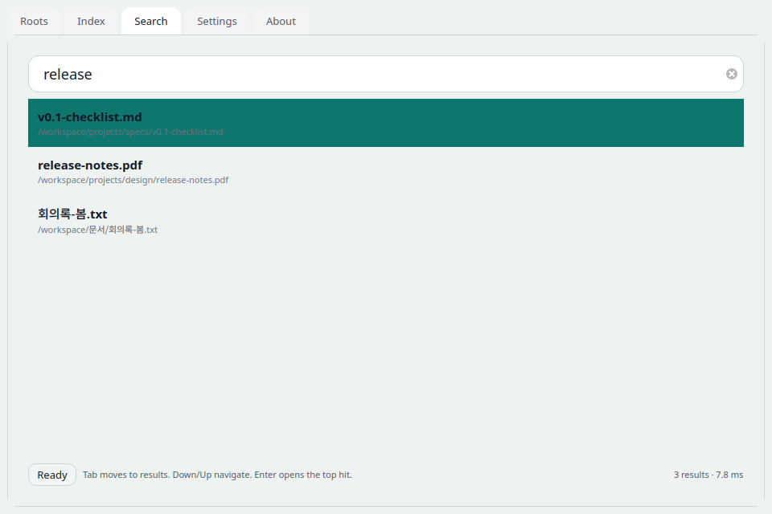
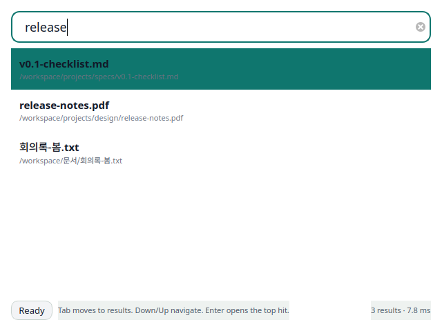
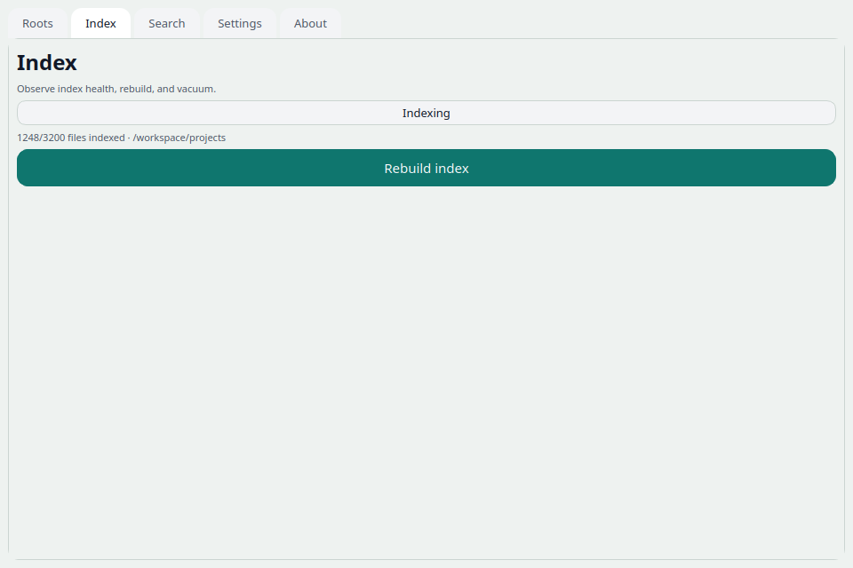
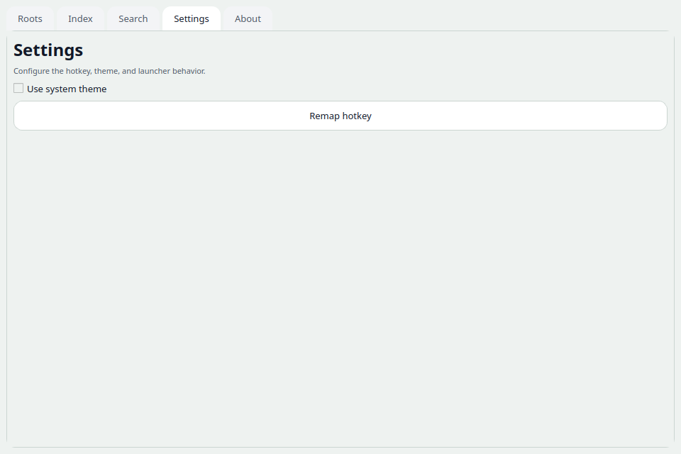

# eodinga

Everything-class instant file search for Windows + Linux. `eodinga` indexes filenames, paths, and supported document text on-device, keeps the index fresh with filesystem notifications, and exposes the same engine through a hotkey launcher, GUI, and CLI.

## Status

This repository tracks the `0.1.x` lexical-search release defined in `SPEC.md`. Semantic search is out of scope for this version.

## Screenshots









All screenshots in this repository are rendered offscreen from the real Qt surfaces with `python scripts/render_docs_screenshots.py`; they are not mockups.

## Install

| Environment | Path |
| --- | --- |
| Linux development | `python3.11 -m venv .venv && source .venv/bin/activate && pip install -e .[all]` |
| Linux packaged app | Build or download the AppImage / `.deb` artifacts and launch `eodinga gui` |
| Windows packaged app | Install `eodinga-0.1.x-win-x64-setup.exe` |

### Linux

```bash
python3.11 -m venv .venv && source .venv/bin/activate && pip install -e .[all]
```

Use `.[all]` for the full v0.1 local-dev surface, including GUI, parser, hotkey, lint, and test dependencies. For packaged builds, use the AppImage or `.deb` artifacts produced by CI.
The Linux release artifacts both launch `eodinga gui`; the `.deb` also installs the desktop entry, SVG icon, and packaged changelog under `/usr/share/doc/eodinga/`.

### Windows

- Download the latest `eodinga-0.1.x-win-x64-setup.exe` release asset.
- Install per-user with the Inno Setup wizard.
- Optionally enable auto-start at login during install.

## Docs Map

- [docs/DSL.md](/home/cheol/projects/eodinga/docs/DSL.md): complete query cheatsheet, operator notes, and composition examples.
- [docs/ACCEPTANCE.md](/home/cheol/projects/eodinga/docs/ACCEPTANCE.md): release gate commands and shipped-doc acceptance checks.
- [docs/ARCHITECTURE.md](/home/cheol/projects/eodinga/docs/ARCHITECTURE.md): runtime flow, index lifecycle, recovery, and packaging surfaces.
- [docs/PERFORMANCE.md](/home/cheol/projects/eodinga/docs/PERFORMANCE.md): opt-in perf suite, scaling knobs, and current local baseline.
- [docs/CONTRIBUTING.md](/home/cheol/projects/eodinga/docs/CONTRIBUTING.md): local workflow, scope guardrails, and test-selection shortcuts.
- [docs/RELEASE.md](/home/cheol/projects/eodinga/docs/RELEASE.md): version bump, changelog, validation, and local tag handoff flow.

## First Run

1. Launch `eodinga gui` or start the installed app.
2. Add one or more roots to index.
3. Keep content indexing enabled if you want document-text matches.
4. Wait for the initial cold start to finish, then use the launcher hotkey.
5. Keep `eodinga watch` or the packaged background flow running if you want live updates outside the main GUI session.

## Quick Start

1. Install with `pip install -e .[all]`.
2. Open `eodinga gui`, add your project or document roots, and let the first index finish.
3. Hit `Ctrl+Shift+Space` to open the launcher anywhere.
4. Start with plain terms, then narrow with operators like `ext:pdf`, `path:docs`, `date:this-week`, or `size:>10M`.
5. Use `Enter` to open the selected result or `Ctrl+Enter` to reveal it in the file manager.
6. Use `Alt+Up` to recall recent queries, `Ctrl+L` to jump back to the filter, and `PgUp` / `PgDn` to move through longer result sets without leaving the keyboard.
7. Re-run `python scripts/render_docs_screenshots.py` if you update the Qt surfaces and want the shipped screenshots refreshed.

## Feature Overview

| Area | Included in `0.1.x` |
| --- | --- |
| Search surfaces | Shared engine across CLI, main GUI, and hotkey launcher. |
| Local-first behavior | Local-only indexing of filenames, paths, and supported document text. |
| Freshness | Real-time refresh through watchdog-backed filesystem events. |
| Query language | Terms, phrases, groups, negation, regex, path filters, size filters, date macros, and duplicate detection. |
| Content extraction | Text, source code, Office files, PDF, EPUB, HTML, and HWP when parser extras are installed. |
| Recovery | Atomic staged rebuild and startup recovery for interrupted index swaps and stale WAL state. |
| Packaging | Windows installer, Linux AppImage, and Linux `.deb` dry-run paths. |

## Search Recipes

| Goal | Command or query |
| --- | --- |
| Build the initial index for two roots | `eodinga index --root ~/projects --root ~/docs` |
| Keep the same roots live | `eodinga watch` |
| Search recent markdown roadmaps | `eodinga search 'date:this-week ext:md roadmap' --limit 20` |
| Find duplicate large files | `eodinga search 'is:duplicate size:>10M' --limit 50` |
| Inspect results as JSON | `eodinga search 'regex:/todo|fixme/i path:src' --json` |
| Verify runtime health | `eodinga doctor && eodinga stats --json` |

## Acceptance Quickcheck

Use this when you want to validate the shipped v0.1 surface before cutting a release:

```bash
source .venv/bin/activate && pytest -q tests && ruff check eodinga tests && pyright --outputjson | python3 -c "import sys,json; s=json.load(sys.stdin)['summary']; print('pyright', s)" && QT_QPA_PLATFORM=offscreen python -c "from eodinga.gui.app import launch_gui; launch_gui(test_mode=True)" && python packaging/build.py --target windows-dry-run && yamllint .github/workflows/release-windows.yml
```

The full SPEC §9 checklist, expected commands, and release-tag workflow live in [docs/ACCEPTANCE.md](/home/cheol/projects/eodinga/docs/ACCEPTANCE.md).

## CLI

```bash
eodinga index [--root PATH] [--rebuild]
eodinga watch
eodinga search "query" [--json] [--limit N] [--root PATH]
eodinga stats [--json]
eodinga gui
eodinga doctor
eodinga version
```

Global flags:

- `--log-level`
- `--config`
- `--db`

Typical flows:

```bash
eodinga index --root ~/projects --root ~/docs
eodinga watch
eodinga search 'ext:pdf content:"release checklist"' --limit 20
eodinga stats --json
eodinga doctor
```

Per-command help is available under `eodinga <subcommand> --help`. The top-level parser currently exposes `index`, `watch`, `search`, `stats`, `gui`, `doctor`, and `version`.

## Query DSL

- `report` : plain lexical term
- `ext:pdf invoice` : extension filter plus term
- `path:projects content:"design review"` : path and content filters
- `size:>10M modified:today` : size and date filters
- `size:100K..500K date:last-month` : bounded range plus date macro
- `date:2026-04-01.. modified:..2026-04-23` : open-ended ISO ranges
- `modified:2026-04-23T09:15:30+00:00` : exact ISO datetime filter
- `date:yesterday is:duplicate` : relative date plus duplicate detection
- `is:empty -is:dir` : empty files only
- `created:2026-04-23` : creation-time filter
- `regex:true report-\\d+` : treat plain terms as regex
- `regex:/todo|fixme/i` : regex search
- `ext:py | ext:rs` : OR
- `-path:node_modules` : negation
- `(invoice | receipt) ext:pdf` : grouping

Full DSL coverage and examples live in [docs/DSL.md](/home/cheol/projects/eodinga/docs/DSL.md).

## DSL Cheatsheet

| Goal | Query |
| --- | --- |
| Search by plain term | `roadmap` |
| Restrict by extension | `ext:pdf invoice` |
| Restrict by path | `path:projects content:"design review"` |
| Find recent files | `date:this-week` |
| Start from an ISO date | `date:2026-04-01..` |
| Stop at an ISO date | `created:..2026-04-23` |
| Match one instant | `modified:2026-04-23T09:15:30+00:00` |
| Find size ranges | `size:100K..500K` |
| Find empty files only | `is:empty -is:dir` |
| Find duplicates | `is:duplicate` |
| Find the previous calendar month | `date:last-month ext:pdf` |
| Exclude noisy trees | `-path:node_modules` |
| Run regex | `regex:/todo|fixme/i` |

## Supported Content Types

- Plain text and source code: `.txt`, `.md`, `.py`, and similar text-first formats.
- Office documents: `.docx`, `.pptx`, `.xlsx`, plus legacy OLE-backed formats handled by the parser extras.
- Publishing formats: `.pdf`, `.epub`, `.html`, and `.hwp` when the parser dependencies are installed.
- Filename and path search still works even when a file type has no content parser or the file is malformed.

## Hotkey

- Default launcher shortcut: `Ctrl+Shift+Space`
- `Esc` hides the launcher
- `Enter` opens the top result
- `Ctrl+Enter` opens the containing folder
- `Shift+Enter` shows file properties
- `Alt+Up` / `Alt+Down` recalls recent queries
- `Up` / `Down` wraps through the result list once focus is in the list
- `PgUp` / `PgDn` jumps through longer result sets
- `Ctrl+L` returns focus to the filter field

## Common Workflows

Open the launcher, search across multiple roots, and reveal the selected hit in the file manager:

```bash
eodinga index --root ~/projects --root ~/docs && eodinga watch
```

```bash
eodinga search 'date:this-week ext:md roadmap' --limit 20
eodinga search 'regex:/todo|fixme/i path:src' --json
eodinga search 'is:duplicate size:>10M' --limit 50
```

Check runtime state when results look stale:

```bash
eodinga doctor
eodinga stats --json
eodinga index --rebuild
```

Scriptable release-health pass:

```bash
source .venv/bin/activate && pytest -q tests && ruff check eodinga tests && pyright --outputjson | python3 -c "import sys,json; s=json.load(sys.stdin)['summary']; print('pyright', s)"
```

## Architecture

The runtime stack is intentionally small: read-only filesystem traversal, SQLite/FTS-backed indexing, a shared DSL compiler/executor, and thin CLI/GUI surfaces. The component map and data flow are documented in [docs/ARCHITECTURE.md](/home/cheol/projects/eodinga/docs/ARCHITECTURE.md).

## Performance

Perf gates remain opt-in in v0.1, but the suite and local baseline are documented in [docs/PERFORMANCE.md](/home/cheol/projects/eodinga/docs/PERFORMANCE.md). Run them locally with:

```bash
source .venv/bin/activate && EODINGA_RUN_PERF=1 pytest -q tests/perf -s
```

Current local-dev baseline: cold start at roughly 6.0k files/sec, 50k-file name/path lookups at about 0.06 ms p95, content queries at about 0.62 ms p95, and watch visibility at about 0.133 s p99.

## Packaging

- Validate Windows packaging inputs with `python packaging/build.py --target windows-dry-run`.
- Validate Linux AppImage packaging with `python packaging/build.py --target linux-appimage-dry-run`.
- Validate Linux Debian packaging with `python packaging/build.py --target linux-deb-dry-run`.

## Recovery and Troubleshooting

- Startup automatically resumes interrupted staged rebuilds (`.index.db.next`), interrupted recovery swaps (`.index.db.recover`), and stale SQLite WAL replay before opening the live index.
- If results look stale, run `eodinga doctor`, then `eodinga stats` to confirm the active database path before rebuilding.
- A one-shot recovery path is `eodinga index --rebuild`; live updates still require `eodinga watch` or the packaged background service flow.
- Documentation and screenshots are part of the shipped contract; refresh the gallery with `python scripts/render_docs_screenshots.py` after visible UI changes.

## Config and Data Paths

- Linux config defaults to `~/.config/eodinga/config.toml` and the index database to `~/.local/share/eodinga/index.db`.
- Windows uses `%APPDATA%\\eodinga\\config.toml` for config and `%LOCALAPPDATA%\\eodinga\\index.db` for the database.
- Override either location with `--config` or `--db` when running CLI commands.
- Runtime writes stay inside those config/database areas; indexed roots are treated as read-only inputs.

## Diagnostics

Run:

```bash
eodinga doctor
```

The doctor command checks Python compatibility, importable dependencies, database writability, readable roots, the detectable hotkey backend, and the default safe excludes.

If search looks stale, run `eodinga stats` to confirm the active database path, then either `eodinga watch` for live updates or `eodinga index --rebuild` to rebuild once.

## Contributing

Contributor workflow lives in [docs/CONTRIBUTING.md](/home/cheol/projects/eodinga/docs/CONTRIBUTING.md). Use it for local setup, quality gates, screenshot refreshes, and scope guardrails before opening a change.

## Release Process

Release-specific steps live in [docs/RELEASE.md](/home/cheol/projects/eodinga/docs/RELEASE.md), with [docs/ACCEPTANCE.md](/home/cheol/projects/eodinga/docs/ACCEPTANCE.md) as the short gate checklist.

## FAQ

### Does `eodinga` send file contents anywhere?

No. The runtime is local-only, the source tree is guarded by `tests/safety/test_no_network.py`, and indexed roots are treated as read-only inputs.

### What happens if indexing is interrupted?

Startup resumes interrupted staged rebuilds and recovery swaps automatically. If recovery still looks suspicious, run `eodinga doctor` and then `eodinga index --rebuild`.

### Do I need parser extras for basic filename search?

No. Filename and path indexing work without parser extras. The `parsers` extra only expands content extraction for supported document formats.

### Which commands are most useful for a quick health check?

Use `eodinga doctor` for dependency and writable-path checks, `eodinga stats --json` for the active database and counters, and `eodinga search 'query' --json` when you want scriptable result inspection.

### Which files are skipped by default?

System and cache paths such as `/proc`, `/sys`, `/dev`, `/tmp`, `$HOME/.cache`, `C:\Windows`, and `%SystemRoot%` stay excluded unless the user explicitly opts in.

### Does uninstall delete my local index automatically?

No. The Windows installer preserves `%LOCALAPPDATA%\eodinga\` unless the uninstall flow explicitly purges it.

### Is semantic search included?

No. `0.1.x` is lexical only.

## Limitations

- Perf gates are opt-in in v0.1. Run `EODINGA_RUN_PERF=1 pytest -q tests/perf -s` for local baselines and regression checks.
- Query quality is lexical-only. There is no semantic ranking, OCR, or cloud sync in this release.
- Content search only covers the parser set bundled in `.[parsers]`; unsupported or encrypted documents fall back to filename/path-only search.
- Live indexing depends on the local watchdog backend. Very large bursty file operations may appear after the debounce window rather than instantly.
- Duplicate detection is content-hash based, so files without parsed content or stable hashes may only match by name/path.

## Uninstall

### Linux

- Remove the package or AppImage.
- Delete the config and data directories if you want to purge local state.

### Windows

- Uninstall `eodinga` from Apps or the Start Menu shortcut group.
- Choose whether to purge `%LOCALAPPDATA%\eodinga\` during uninstall.

## License

MIT. See `LICENSE`.
